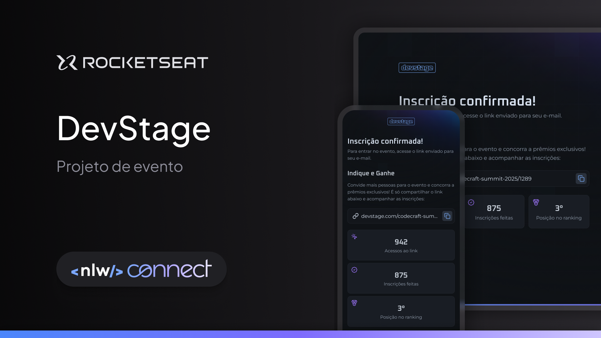

# DevStage
*It's a project of the NLW Connect event.*  
*É um projeto do evento NLW Connect.*  
*Es un proyecto del evento NLW Connect.*

 

  

---

## 🗂️ Table of Contents | Índice | Indice
1. [About the Project | Sobre o Projeto | Sobre el Proyecto](#about-the-project--sobre-o-projeto--sobre-el-proyecto)
2. [Key Features | Caraterísticas Principais | Características Principales](#key-features--características-principais--características-principales)
3. [Technologies | Tecnologias | Tecnologías](#technologies--tecnologias--tecnologías)
4. [Layout | Estrutura | Estructura ](#layout--estrutura--estructura)
5. [Authors and Acknowledgments | Autores e Agradecimentos | Autores y Agradecimientos](#authors-and-acknowledgments--autores-e-agradecimentos--autores-y-agradecimientos)

---

## 📃 About the Project | Sobre o Projeto | Sobre el Proyecto

*DevStage** he project is a responsive event registration and ticketing website.
This is a project for the NLW Connect event, one of the contents available to Rocketseat students.   
*DevStage** O projeto é um site responsivo de inscrição e indicação para eventos.
Esse é um projeto do evento NLW Connect, um dos conteúdos disponíveis para alunos da Rocketseat.   
*DevStage** El proyecto es un site web responsivo de registro y recomendación de eventos.
Se trata de un proyecto para el evento NLW Connect, uno de los contenidos disponibles para los estudiantes de Rocketseat.

### 📌 Why did we create DevStage? | Por que criamos o DevStage | ¿Por qué creamos el DevStage?
- É um projeto da NLW Connect.  
Para proporcionar momentos de prazer.   
---

## 🚀 Key Features | Características Principais | Características principales

- Um link é enviado para o e-mail do participante.
Com este link o participante acessa o evento. 
O participante tem a possibilidade de convidar mais pessoas para o evento e concorrer a prêmios exclusivos. Compartilhando o link exclusivo que é gerado quando o participante entra no evento.  
- Se envía un link a la dirección de correo electrónico del participante.
Con este enlace, el participante accede al evento. 
El participante tiene la posibilidad de invitar a otras personas al evento y competir por premios exclusivos. Compartir el link exclusivo que se genera cuando el participante entra en el evento.    
---

## 🚀 Technologies | Tecnologias | Tecnologías

This project (website) was developed using the following technologies:  
Este projeto (website) foi desenvolvido com as seguintes tecnologias:  
Este proyecto (website) se ha desarrollado utilizando las siguientes tecnologías:
> **Sobre o Website**  
> **React**  
> **Next**  
> **Typescript**  
> **Tailwindcss**  
> **Zod**  
> **Git & GitHub**  
> **Figma**   
> **Sobre a API**  
> **Node**  
> **Typescript**  
> **Drizzle**  
> **Fastify**  
> **Zod**  
> **JWT**  
> **Biome**  
> **Postgres**  
> **Redis**  
> **Swagger**  

Access the completed project by clicking on the link below:  
Acesse o projeto finalizado online clicando no link abaixo:  
Consulte el proyecto finalizado en línea haciendo click en el link a bajo:

[clique aqui...](https://lfrclnando.github.io/tourist-site/)

---

## 🔖 Layout | Estrutura | Estructura

You can view the interface layout of the original project by clicking below... 
Você pode visualizar a estrutura da interface do projeto original clicando abaixo... 
Puede ver la estructura de la interface del proyecto original haciendo click a bajo...  
[NESSE LINK](https://www.figma.com/design/WsnyOJ0R0KT9BXHQomczqj/NLW-Connect-%E2%80%A2-DevStage--Community-?node-id=0-1&p=f&t=dHpg7CrHGQeoe7eO-0).   
You must have an account with [Figma](https://figma.com) to access it.  
É necessário ter conta no [Figma](https://figma.com) para acessá-la.  
Debe tener una cuenta en [Figma](https://figma.com) para entrar a ella.

---

## 💻 Authors and Acknowledgments | Autores e Agradecimentos | Autores y Agradecimientos

<h3 align="right">Um projeto da semana NLW da Rocketseat</h3> 
<h4 align="right">Reproduzido com muito carinho por 🦅 Fernando</h4>
